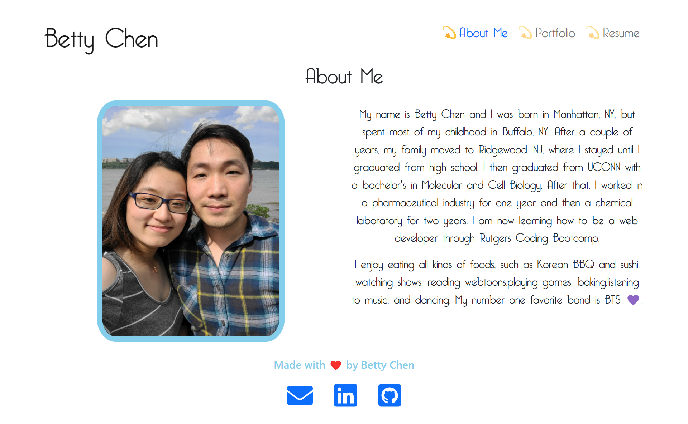
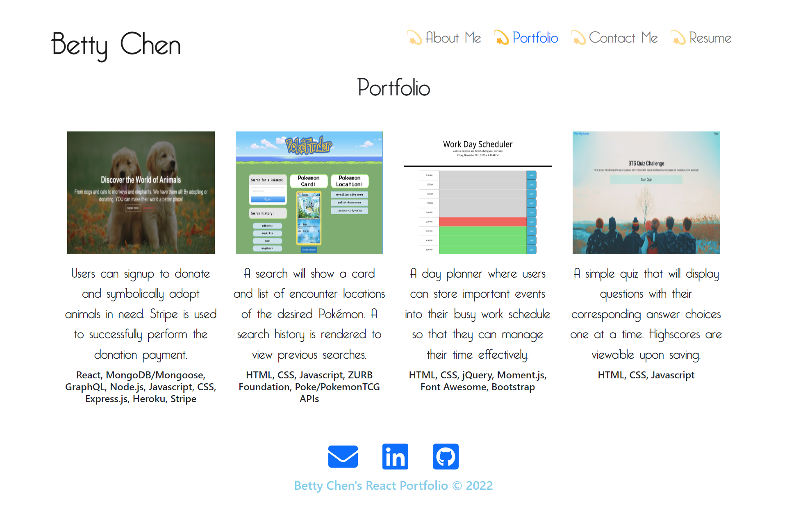

# React Portfolio

 

- [Description](#description)
- [Usage](#usage)
- [Screenshots](#screenshots)
- [GitHub](#github)
- [Lincense](#license)
- [Contributing](#contributing)
- [Questions](#questions)

## Description

Created my first React Portfolio using React components. Instead of having a static portfolio, I learned about displaying different pages using components. React makes it so it is possible to re-use code components to increase efficiency when developing apps. Mobile responsiveness and UI was achieved using React Bootstrap.

## Usage

After cloning the repository, in the root folder, run "npm i" for the necessary npm packages that are already listed in the package.json files. Next, run "npm start" which will automatically open a browser tab to view this application.

## Screenshots

## GitHub

Click [here](https://bchen41.github.io/react-portfolio/) for the deployed application!

## License

 
Copyright © 2022 [Betty Chen](https://github.com/bchen41).  
This project is [MIT](https://github.com/bchen41/react-portfolio/blob/main/LICENSE) licensed.

## Contributing

All are welcomed to contribute as long as the standard industry guidelines are being followed.
Click [here](https://www.contributor-covenant.org/) for industry standard guidelines.

## Questions

For additional questions, contact me by reaching me at my [email](mailto:bettychen41@outlook.com).

You can find my other projects at my [GitHub](https://github.com/bchen41) profile.

Author: Betty Chen
